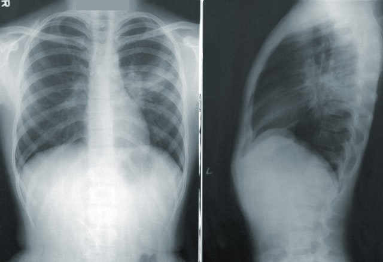
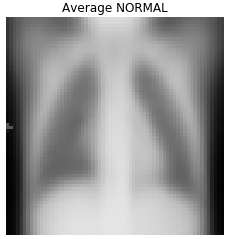
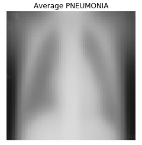

## Identifying Pneuomonia in Chest X-Rays Using Neural Networks
#### ***Justin Fernandez and Lauren Phipps***

<span>Photo by <a href="https://unsplash.com/@cdc?utm_source=unsplash&amp;utm_medium=referral&amp;utm_content=creditCopyText">CDC</a> on <a href="https://unsplash.com/s/photos/pneumonia?utm_source=unsplash&amp;utm_medium=referral&amp;utm_content=creditCopyText">Unsplash</a></span>


## Repository Structure

```
├── chest_xray                   <- Images used in data sets
├── EDA                          <- Notebooks pertaining to EDA and Visualization
├── images                       <- Images and charts used in this project
├── ModelingProcess              <- Notebooks showing interative modeling process
├── Final-Notebook.ipynb         <- Final notebook of project
├── README.md                    <- The high-level overview of this project
├── Presentation.pdf             <- PDF version of project presentation
└── datacleaning.py              <- Code file for data cleaning and preparation
```

## Overview

This project aims to create an image classifier for identifying pneumonia in lung x-rays using neural networks in order to be able to identify patients with pneumonia based on their x-ray. Pneumonia is a lung infection where the air sacs will fill with fluid, making it hard to beathe. Pneumonia is typically diagnosed through identifying white, cloudy spots on a chest x-ray. Creating an image classifier would allow doctors to feed in images of x-rays and more quickly and accurately identify patients who will need treatment for pneumonia. A model was created and training using 5,000 images of chest x-rays labeled as "normal" or as having pneumonia. A convolutional neural network was created that led to an accuracy of 87.8% and a recall score of 89.8%. Overall, the model is somewhat successful at identifying pneumonia in chest x-rays with a low rate of false negatives (classifying an x-ray as being normal when it really has pneumonia). The next steps, though, would be to continue to iterate on the model by adding in more images to train it with and hopefully continue to increase it's recall. 

## Business Problem

Pneuomonia is an infection in the lungs that causes the air sacs to fill with fluid making it difficult to breathe, particularly for older patients, very young patients, or patients with weakened immune systems. Diagnosis comes from identifying the infection, seen as white spots, with a chest x-ray. However, it can sometimes be challenging for humans to spot these abnormalities, so neural networks can be beneficial for analyzing and classifying lung x-rays of pneumonia patients. This project aims to create a neural network that, given an image of a chest x-ray, correctly identify whether or not the patient has pneumonia. Approximately 50,000 people per year die of pneumonia in the United States alone, therefore, it is incredibly important to accurately identify patients suffering from pneumonia to get them the treatment that they need.

## Data Understanding and Preparation

The data for this project is a collection of images of chest x-rays from both healthy patients and patients with pneumonia. These were broken into three sets: a training set, a validation set, and a testing set. There are 5,216 images in the training set, 16 images in the validation set, and 624 in the testing set. Within the training set, there are 1,341 healthy images and 3,875 pneumonia images. Examples of each are below.


This is an x-ray from a healthy patient. The lungs are clear.


This is an x-ray from a patient with pneuomonia. The right side of the lungs is cloudy, which shows the infection from pneuomonia.

The mean image of a normal x-ray and an x-ray with pneumonia can be seen below. This further highlights the cloudiness that is present in an x-ray with pneumonia that the model will be identifying. 




## Results

The best model was found to be a Convolutional Neural Network. It used data augmenting to rotate the images. Augmenting the images provides with the model with more information about the images and prevents the model from simply "memorizing" what the x-rays look like. The model consisted of **four convolutional layers with a 'relu' activation function**, followed by **four dense layers with a 'tanh' activation function with dropout layers in between**, and ending with an **output layer with a 'sigmoid' activation function**. The model had **15 epochs**. 


## Evaluation

For this project, we focused on the recall and accuracy score. With identifying pneumonia, it is more important to minimize false negatives, as it is worse to say someone does not have pneumonia when they do and have them not receive treatment. In order to ensure we were minimized false negatives, we used recall. We also used accuracy as the measure between sets to determine if models were overfit or underfit. The final model has an accuracy of 87.8% and a recall score of 89.8%. 

## Conclusions and Next Steps

Overall, the model will successfully identify lung x-rays with pneuomonia, which can be used to determine which patients need treatment. However, more data can always be added to the model to continue to improve the quality of the model and ensure that no patients are incorrectly labeled as healthy when they actually need treatment. The next steps are to continue to iterate on the model and look more closely at the images that it incorrectly classifies to determine commonalities and address those issues in future models. 